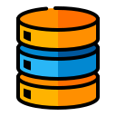
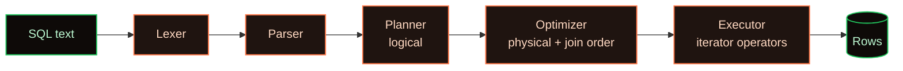
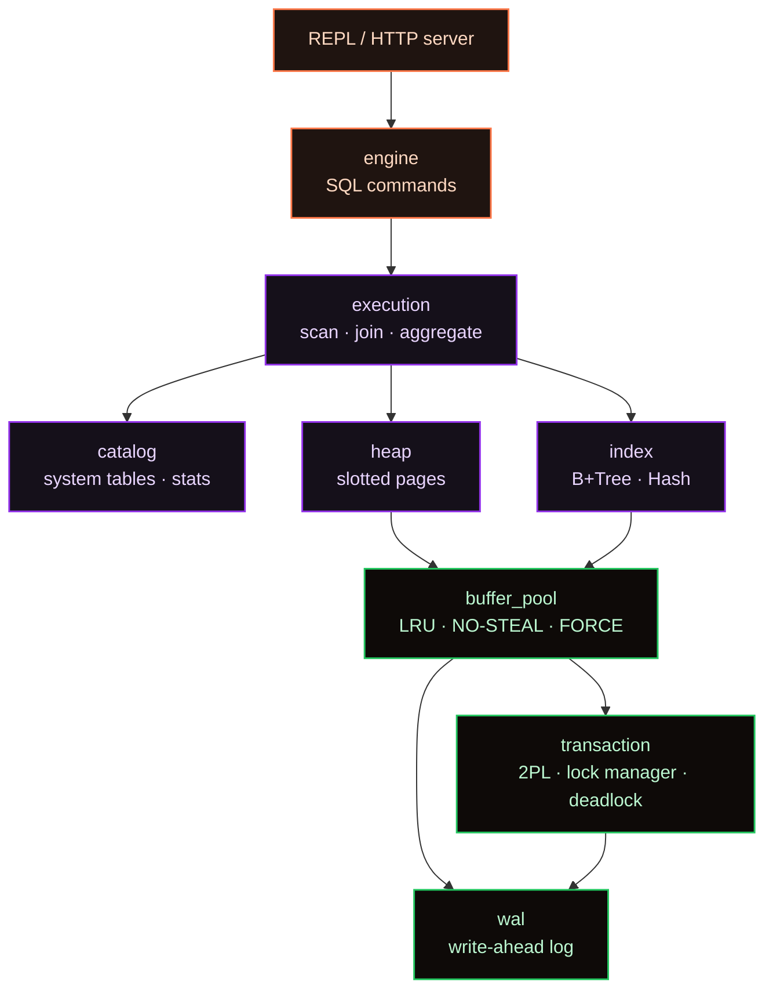

<div align="center">



<br/>

[](rust-toolchain.toml)
[](db/Cargo.toml)
[](LICENSE)
[](Dockerfile)
[](#-testing)
[](CONTRIBUTING.md)

### **A relational database engine, built from scratch in Rust.**

No SQLite. No RocksDB. No Postgres bolted under the hood.
Every byte — buffer pool, WAL, lock manager, optimizer — is ours.

<sub>

[**Quick start**](#-quick-start) ·
[**Features**](#-features) ·
[**Architecture**](#-architecture) ·
[**SQL examples**](#-sql-examples) ·
[**Performance**](#-performance) ·
[**Roadmap**](#-roadmap) ·
[**Contributing**](CONTRIBUTING.md)

</sub>

</div>

---

## 🎯 What is StoreMy?

> **StoreMy is an educational, production-patterned relational database engine.**
> It implements the hard parts of a DBMS — buffer pool, page cache, write-ahead log, lock manager, cost-based optimizer, multiple join algorithms — entirely in safe Rust. Built to be **read, hacked on, and learned from.**

<table>
<tr>
<td width="33%" align="center">
<h3>🦀<br/>Pure Rust</h3>
<sub>Edition 2024, zero <code>unsafe</code> in hot paths. Strict clippy.</sub>
</td>
<td width="33%" align="center">
<h3>📚<br/>Textbook architecture</h3>
<sub>Clean module boundaries — read it like a textbook.</sub>
</td>
<td width="33%" align="center">
<h3>🔬<br/>End-to-end tested</h3>
<sub>Integration tests against the public <code>Database</code> API.</sub>
</td>
</tr>
</table>

---

## ⚡ Quick start

<table>
<tr>
<td width="50%" valign="top">

### 🐳 Docker — 2 minutes, zero install

```bash
make quickstart
# or
docker compose up storemy
```

Boots the interactive SQL REPL.
Data persists in the `storemy-data` volume at `/app/data`.

</td>
<td width="50%" valign="top">

### 🛠 From source

```bash
git clone https://github.com/utkarsh-priyadarshi/storemy.git
cd storemy

cargo run -p storemy -- repl           # interactive REPL
cargo run -p storemy -- "SELECT 1;"    # one-shot SQL
cargo build -p storemy --release       # optimized binary
```

> Needs **Rust 1.89** (auto-pinned via `rust-toolchain.toml`).

</td>
</tr>
</table>

### Environment

| Variable    | Description                              | Default   |
| :---------- | :--------------------------------------- | :-------- |
| `DATA_DIR`  | Directory for WAL, catalog, REPL history | `./data`  |
| `RUST_LOG`  | `tracing` filter — e.g. `storemy=debug`  | `info`    |

---

## ✨ Features

<table>
<tr>
<td width="33%" valign="top">

### 💾 Storage engine

- **Slotted 4 KB pages** for variable-length tuples
- **B+Tree indexes** — split, merge, range scan, sibling pointers
- **Hash indexes** — separate chaining, FNV‑1a
- **Buffer pool** — LRU + NO‑STEAL / FORCE
- **Heap files** with dirty-page tracking

</td>
<td width="33%" valign="top">

### 🔒 Transactions

- Full **ACID** — `BEGIN`, `COMMIT`, `ABORT`
- **Strict 2PL** at page granularity
- **Deadlock detection** via wait-for graph
- **Write-ahead logging** with force‑at‑commit
- Before-image **rollback**

</td>
<td width="33%" valign="top">

### 🚀 Query execution

- SQL: `SELECT` / `INSERT` / `UPDATE` / `DELETE` / DDL
- **Cost-based optimizer** with stats
- **Three join algorithms** — BNL · Hash · Sort‑Merge
- **Aggregates** — `COUNT` `SUM` `AVG` `MIN` `MAX` + `GROUP BY`
- **Iterator model** — streaming, low memory

</td>
</tr>
<tr>
<td width="33%" valign="top">

### 📚 System catalog

- Self-describing **system tables**
- **Auto-increment** columns
- Live **table statistics** for the optimizer
- Background **stats updater** task

</td>
<td width="33%" valign="top">

### 🖥 Interfaces

- **Terminal REPL** — `rustyline` + `comfy-table`
- **Persistent history** under `DATA_DIR`
- **One-shot SQL** for scripting
- **HTTP server** (`storemy-server` binary, axum)

</td>
<td width="33%" valign="top">

### 🔭 Observability

- Structured logs via **`tracing`**
- **OpenTelemetry / OTLP** export
- **Prometheus** metrics exporter
- Optional **Jaeger / Tempo** stack

</td>
</tr>
</table>

---

## 📖 SQL examples

```sql
-- DDL
CREATE TABLE employees (
    id          INT,
    name        VARCHAR,
    department  VARCHAR,
    salary      FLOAT,
    hire_date   VARCHAR
);

-- DML
INSERT INTO employees (id, name, department, salary, hire_date)
VALUES (1, 'Alice Johnson', 'Engineering', 95000.00, '2023-01-15');

-- Filter
SELECT name, salary
FROM   employees
WHERE  salary > 80000;

-- Join
SELECT e.name, d.department_name, e.salary
FROM   employees e
JOIN   departments d ON e.department = d.id
WHERE  e.salary > 70000;

-- Aggregate
SELECT department, COUNT(*), AVG(salary)
FROM   employees
GROUP  BY department;

-- Mutate
UPDATE employees SET salary = 100000.00 WHERE id = 1;
DELETE FROM employees WHERE hire_date < '2020-01-01';
DROP   TABLE employees;
```

---

## 🏛 Architecture

### Query pipeline



### Module map



<details>
<summary><b>📁 Repository layout</b></summary>

```text
StoreMy/
├── db/                       # crate: `storemy`
│   ├── src/
│   │   ├── buffer_pool/      # page cache, LRU, NO-STEAL / FORCE
│   │   ├── catalog/          # system tables, statistics
│   │   ├── engine/           # SQL command executors (CREATE / INSERT / …)
│   │   ├── execution/        # operators: scan, join, aggregate, set-ops
│   │   ├── heap/             # slotted pages, heap files
│   │   ├── index/            # B+Tree, Hash
│   │   ├── parser/           # lexer, parser, AST
│   │   ├── repl/             # interactive SQL shell
│   │   ├── wal/              # write-ahead log, recovery
│   │   ├── web/              # HTTP handlers (storemy-server)
│   │   └── transaction.rs    # 2PL, lock manager, deadlock detection
│   ├── benches/              # Criterion benchmarks
│   └── tests/integration*    # E2E tests against public `Database` API
├── storemy-codec-derive/     # proc-macros for on-disk Encode/Decode
├── monitoring/               # Prometheus / Grafana / Jaeger stack
├── Dockerfile                # multi-stage release image
└── docker-compose.yml        # repl · tests · benchmarks · monitoring
```

</details>

<details>
<summary><b>🔒 Concurrency & recovery details</b></summary>

**Concurrency control**

- Page-level **shared / exclusive** locks
- Automatic **upgrade** `S → X` when needed
- **Wait-for graph** + cycle detection → abort &amp; retry
- Strict 2PL ⇒ **serializable** isolation

**Recovery**

- **WAL protocol** — log record on disk *before* page mutation
- **Force-at-commit** — `COMMIT` fsync'd before ack
- **LSN chaining** for log traversal
- Record types: `BEGIN` · `COMMIT` · `ABORT` · `INSERT` · `UPDATE` · `DELETE`
- Undo on abort restores before-images

</details>

---

## 🧮 Join algorithm selection

The cost-based optimizer picks per query based on **predicate type**, **cardinality**, and **available memory**.

| Algorithm | Best for | Time | Space |
| :--- | :--- | :--- | :--- |
| 🔁 **Block Nested Loop** | Non-equality predicates, small relations | `O(\|R\| + (\|R\|/B)·\|S\|)` | `O(B)` |
| 🗂 **Hash Join** | Equi-joins with enough memory | `O(\|R\| + \|S\|)` avg | `O(\|S\|)` |
| 🪜 **Sort‑Merge** | Pre-sorted / very large inputs | `O(\|R\| log \|R\| + \|S\| log \|S\|)` | `O(1)` merge |

---

## 📊 Performance

| Layer | Knob | Default |
| :--- | :--- | :--- |
| Page size | fixed | **4 KB** |
| Buffer pool | capacity | **1 000 pages** (≈ 4 MB) |
| B+Tree | point &amp; range | **O(log n)** |
| Hash index | average lookup | **O(1)** |
| Lock granularity | — | **page-level** |
| Deadlock retry | max attempts | **100**, 1 ms → 50 ms backoff |
| Join block size | configurable | **100 tuples** |

Run benchmarks locally:

```bash
docker compose --profile benchmark up storemy-benchmark
# reports land in ./benchmark-results
```

---

## 🧪 Testing

```bash
cargo nextest run --workspace                       # full suite (CI runs this)
cargo nextest run -p storemy --test integration     # end-to-end only
make quick-test                                     # storemy lib unit tests only
make check                                          # fmt + clippy + ci-test
```

| Tier | Location | Notes |
| :--- | :--- | :--- |
| **Unit** | next to each module under `db/src/**` | fast, focused |
| **Integration** | `db/tests/` | drives the public `Database` API |
| **Benchmarks** | `db/benches/` | Criterion-based |

---

## 🐳 Docker workflows

```bash
make docker-build   # release image: storemy + metrics_exporter
make docker-demo    # interactive REPL in a container
make docker-test    # cargo test -p storemy --test integration
make docker-clean   # tear down volumes & images
```

`docker-compose.yml` ships profiles for **default** (REPL), **test**, **benchmark**, and **monitoring** (Prometheus + Grafana + Jaeger).

---

## 🗺 Roadmap

<table>
<tr>
<td width="50%" valign="top">

### ✅ Shipped

- ACID transactions, strict 2PL, deadlock detection
- B+Tree &amp; Hash indexes with on-disk codec
- Cost-based optimizer + 3 join algorithms
- Write-ahead log with undo on abort
- REPL · HTTP server · OTLP tracing

</td>
<td width="50%" valign="top">

### 🚧 Next up

- Full ARIES-style **redo** on recovery
- **MVCC** for snapshot isolation
- **Composite** &amp; **covering** indexes
- **Join reordering** in the optimizer
- Subqueries, views, prepared statements
- Parallel execution, page &amp; log compression
- Client/server **wire protocol**

</td>
</tr>
</table>

---

## 🎨 Design philosophy

1. **Separation of concerns** — storage, execution, and concurrency never reach across layers.
2. **Iterator everywhere** — one uniform interface lets operators compose like Unix pipes.
3. **Strategy pattern** — join algorithms are pluggable; the optimizer picks.
4. **ACID, not eventually** — strict 2PL + WAL with force‑at‑commit.
5. **Production patterns** — typed errors (`thiserror`), structured logging (`tracing`), zero-warning clippy.

---

## 🤝 Contributing

Issues, PRs, and architecture discussions are very welcome — clarity is a feature here.
See **[CONTRIBUTING.md](CONTRIBUTING.md)** for the full workflow.

```bash
cargo +nightly-2026-04-01 fmt --all -- --check
cargo clippy --workspace --all-targets -- -D warnings
cargo nextest run --workspace --profile ci
```

---

## 📚 Acknowledgments

Inspired by *Database System Concepts* (Silberschatz et al.), *Database Management Systems* (Ramakrishnan &amp; Gehrke), **CMU 15‑445/645**, and the architectures of PostgreSQL, SQLite, and MySQL.

## 📄 License

Released under the **MIT License** — see [LICENSE](LICENSE).

<br/>

<div align="center">
<sub>Built with passion for systems programming and database internals.</sub>
</div>
